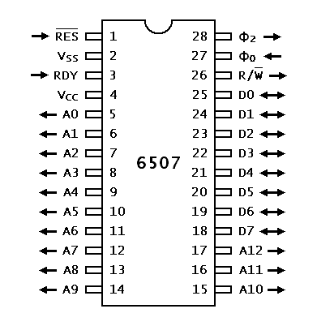
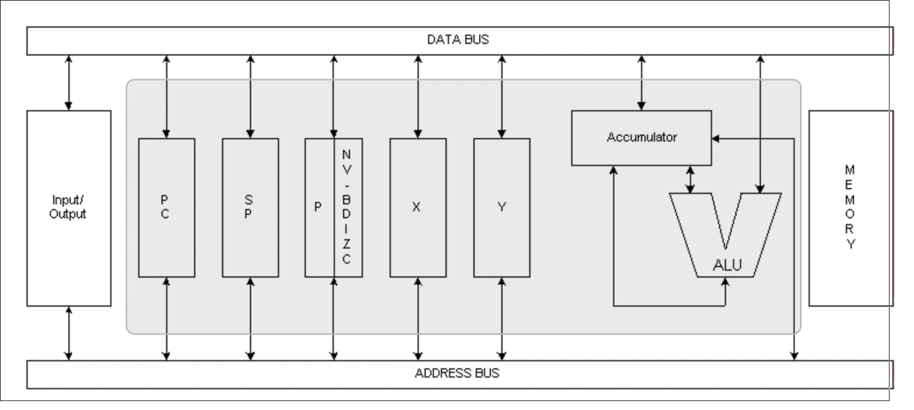

## The 6507 Processor

* The 6507 is a 28-pin processor used in the Atari 2600 game console.
* 13 address lines, 8 data lines.
* Remaining are:
  * Power
  * CPU timing clock
  * CPU reset
  * Request bus wait (RDY)
  * Read/Write (R/W)
* Theres is no IRQ or NMI.
* The CPU ticks at 1.19 MHz.



The processor have 6 registers:
* Program Counter (PC): 16-bit register that holds the address of the next instruction to be executed.
* Stack Pointer (SP): 8-bit register that holds the address of the top of the stack. Actually, has 9 bits, but the 9th bit is always 1 (0000 0001 .... ....)
* Processor Flags (P): 8-bit register that holds the status of the processor.
* Accumulator (A): 8-bit register that holds the result of arithmetic and logical operations. Only one that can be used with the ALU.
* X and Y are general purpose registers.



Processor Status Register (P):
 7 6 5 4 3 2 1 0
[n v - b d i z c]

* n: Negative     - 0: Positive, 1: Negative
* v: Overflow     - 0: No overflow, 1: Overflow
* -: Unused
* b: Break        - 0: No break, 1: Break
* d: Decimal mode - 0: Normal, 1: Decimal mode
* i: Interrupt    - 0: Interrupts enabled, 1: Interrupts disabled
* z: Zero         - 0: Non-zero, 1: Zero
* c: Carry        - 0: No carry, 1: Carry

### difference between carry and overflow

Carry is used when making arithmetic operations and the result is bigger than 255 (8-bit).
for example

   1 1 1 1  1 1 1 1
+  0 0 0 0  0 0 0 1
-------------------
1  0 0 0 0  0 0 0 0
|
+---> Carry

Overflow has something to do with the sign of the number. It is used when making arithmetic operations and the result is bigger than 127 (8-bit).

   0 1 1 1  1 1 1 1 = 127
+  0 0 0 0  0 0 0 1 = 1
-------------------
   1 0 0 0  0 0 0 0 = -128

NOTE: we dont have a carry here, but we have an overflow.

This is related with the implementation of negative numbers in the 6507. The 6507 uses the complement of 2 to represent negative numbers.

### Complement of 2

* The 6507 uses the complement of 2 to represent negative numbers.

a good way to explain how it works is to think of the MSB as the amount of negative summed to the number.

-
1
2 6 3 1
8 4 2 6  8 4 2 1

0 1 1 1  1 1 1 1 = 127

-
1
2 6 3 1
8 4 2 6  8 4 2 1

1 0 0 0  0 0 0 0 = -128

1 1 1 1  1 1 1 1 = -1

### Popular instructions

```assembly
; Load and Store:

LDA ; Load Accumulator
LDX ; Load X
LDY ; Load Y
STA ; Store Accumulator
STX ; Store X
STY ; Store Y

; Arithmetic:

ADC ; Add with Carry

SBC ; Subtract with Carry

; Its always a good idea to clear or set the carry flag before using ADC or SBC

CLC ; Clear Carry, use before ADC
SEC ; Set Carry, use before SBC

INC ; Increment
INX ; Increment X
INY ; Increment Y

DEC ; Decrement
DEX ; Decrement X
DEY ; Decrement Y

; inc and dec instructions set the zero and negative flags

JMP ; Jump (GOTO)
BCC ; Branch if Carry Clear     C == 0
BCS ; Branch if Carry Set       C == 1
BEQ ; Branch if Equal           Z == 1
BNQ ; Branch if Not Equal       Z == 0
BMI ; Branch if Minus           N == 1
BPL ; Branch if Positive        N == 0
BVC ; Branch if Overflow Clear  V == 0
BVS ; Branch if Overflow Set    V == 1

; loop example

    ldy #100 ;y=100
Loop:
    dey      ;y--
    bne Loop ;if y != 0, loop

```


### Importante Assembly Terminology

* Directives: commands that we can send to the assembler to tell it to do something, like locating code in memory, or inserting raw data into the ROM. Directives should always be indented to the right and some programmers start them with a dot. e.g. `.org $F000`.
* Labels: a label is a name that we give to a memory address. Labels should always be indented to the left and end with a colon. e.g. `Loop:`
* Operands: the arguments that we pass to an instruction. e.g. `LDA #$80`

### Addressing Modes

* Immediate: `LDA #80`
* Absolute: `LDA $80`

One important thing to notice is that `LDA $80` is not the same as `LDA #80`. The first loads the IMMEDIATE value 80 to the accumulator and the second loads the accumulator with the value inside the MEMORY ADDRESS $80. Thats is very important and the difference is not just hex/dec.

Thats why we have to load the IMMEDIATE HEX DECIMAL VALUE in the register to manipulate has a number, like `LDX #$80`

