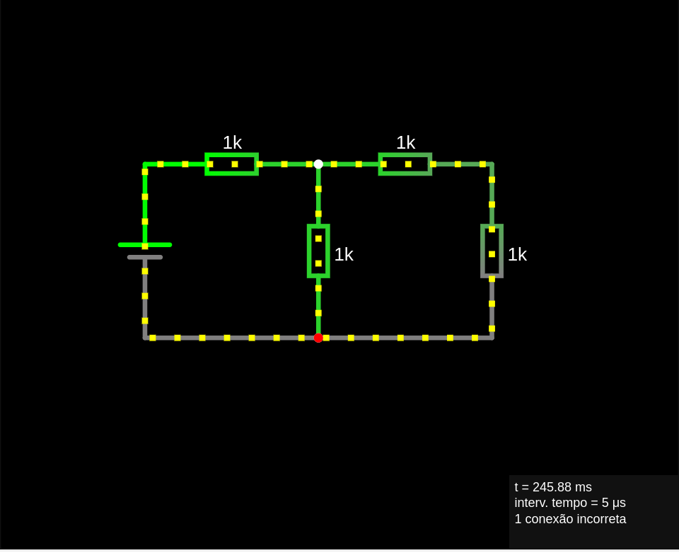
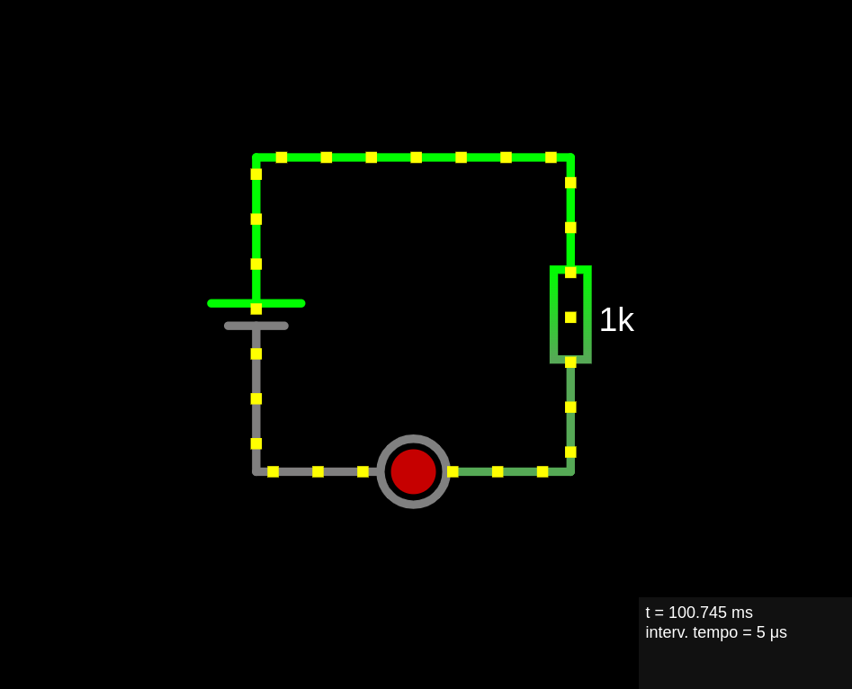
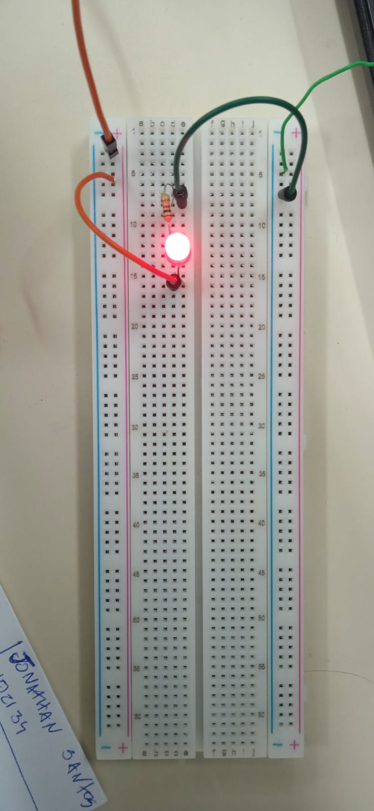
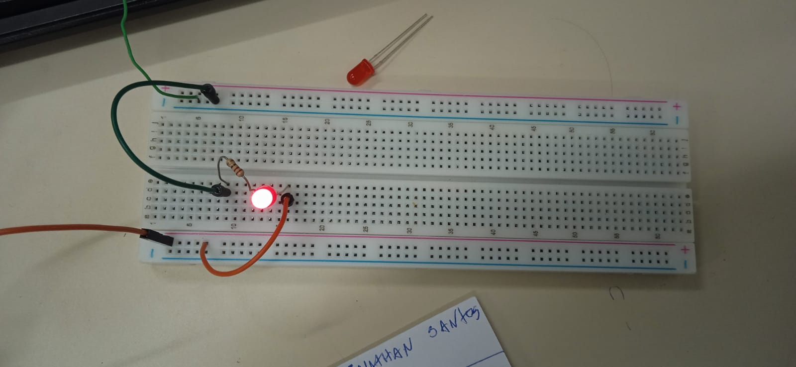
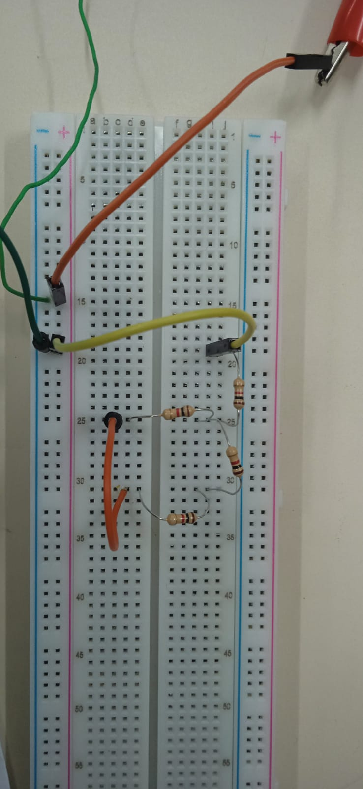
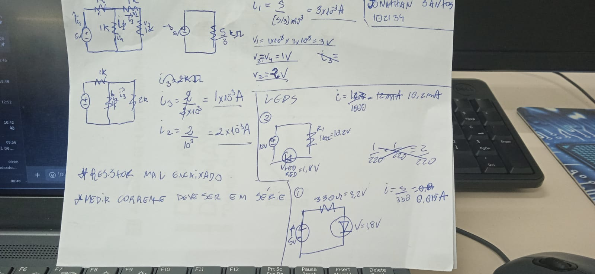

## Laboratório 16-04-2024

Jonathan Santos

102134

### Circuito com 4 resistores

Calcular, simular e implementar o seguinte circuito:

Calculos:

$i_1 = \frac{5}{(5 / 3)*10^{3}} = 3mA$

$V_1 = 1*10^{-3}*3*10^{-3} = 3V$

$V_2 = 2V$

$V_3 = V_4 = 1V$

$i_2 = \frac{2}{1*10^{3}} = 2mA$

$i_3 = \frac{2}{2*10^{3}} = 1mA$

### Circuito 1 LED e 1 Resistor

Calcular, simular e implementar os seguintes circuitos:

Onde os resistores devem possuir, respectivamente, 330* e 1000 Ohms.

\* usei 220 pois não encontrei 330

Calculos primeiro circuito:

$V_{fonte} = 12$

$V_{led} = 1.8V$

$R_1 = 1k\Omega$

$i = \frac{10.2}{1000} = 10.2mA$

Calculos segundo circuito:

$V_{fonte} = 5$

$V_{led} = 1.8V$

$R_1 = 330\Omega$

$i = \frac{5}{330} = 15mA$

### Implementação:

### Calculos feitos em aula

