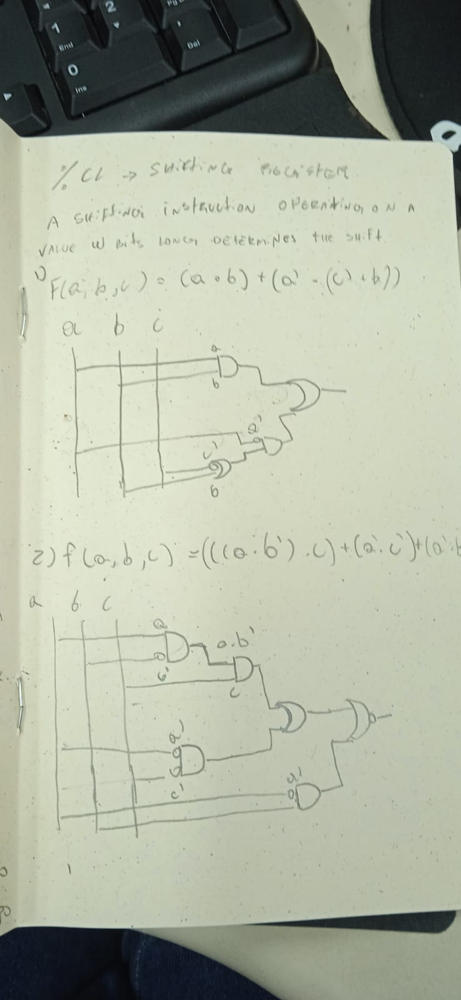

### Escreva a expressão algébrica dos circuitos abaixo

a) (a . b) . (e + (c . d))

b) (x + y) . (z + (t . y))

### Desenhe o circuito com portas lógicas

a) F(a, b, c) = (a . b) + (a' . (c' + b))

b) F(a,b,c) = ((a.b’.c)’ + (a’.c’) + (a’.b))’

c) F(p,q) = (p’ xor q) + (p’ + q)

### Determina a função correspondente ao circuito com portas lógicas

(((a + b)' xor c) + (c' . b)')'

### 4

MotorON(int1, int2, int3) = (int1 + int2) . int3

### 5

Uma das 4 portas? Ou uma das duas portas da frente?

A operação lógica que descreve o problema é o OU (+)

Se forem as duas portas da frente:

| a | b | a v b |
| - | - |   -   |
| 1 | 1 |   1   |
| 1 | 0 |   1   |
| 0 | 1 |   1   |
| 0 | 0 |   0   |

A lógica se extende para 4 portas, sendo `(a v b) v (c v d)`